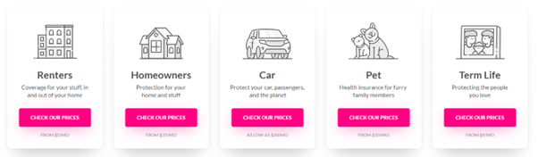
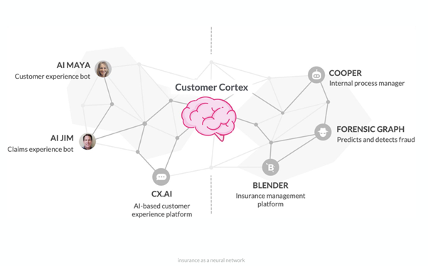
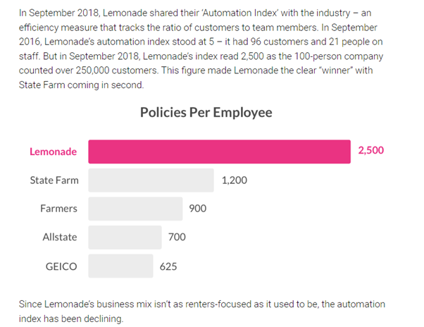
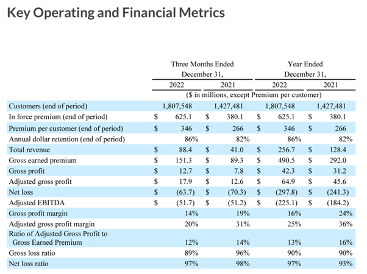

# Module.1.Challenge by Charlie Tannous
##### FinTech Case Study on Lemonade Inc.
***
## Table of contents
* [Overview and Origin](#overview-and-origin)
* [Business Activities](#business-activities)
* [Landscape](#landscape)
* [Results](#results)
* [Recommendations](#recommendations)
* [References](#references)

## Overview and Origin

* **What is the name of the company?** Lemonade

* **When was the company incorporated?** Lemonade was founded in 2015 (Tel Aviv, Isreal)

* **Who are the founders of the company?** The founders are Daniel Schreiber and Shai Wininger 

* **How did the idea for the company (or project) come about?** According to the founders they wanted to create an insurance company that had a different "word cloud” associated with it. In other words they wanted to create a insurance company which was fresh, young, vibrant and positive with a strong customer centric focus. As both founders were existing tech entrepreneurs they decided to pick the insurance industry because of the following reasons:
    * The insurance company was yet to be disrupted
    * The insurance market was huge and gaining only 5% of the market share would be a large number.
    * It was an unloved sector which hadn’t changed much in the last 100 years.

* **How is the company funded? How much funding have they received?** According to Crunchbase, Lemanonde raised 481.5M in a number of VC rounds leading up to there IPO. At IPO the valuation reached 1.6B with 319M being raised at the time of the IPO. 

## Business Activities

* **What specific financial problem is the company or project trying to solve?** Lemonade is an insurance company that aims to provide a customer-centric experience by using AI to cut costs and improve efficiency in the insurance industry. By utilising machine learning and AI to fast track claims and cut costs these cost savings can then be passed back onto to the users. 

* **Who is the company's intended customer?  Is there any information about the market size of this set of customers?** In its investor presentations and filings with the U.S. Securities and Exchange Commission (SEC), Lemonade has provided some general information about its market opportunity and target demographics. For example, Lemonade has stated that it is targeting "digitally-native" millennials who are looking for a more streamlined and transparent insurance experience. Lemonade has also stated that it believes its market opportunity is significant, with the global insurance industry estimated to be worth trillions of dollars annually. In addition, Lemonade has identified several market trends that it believes are driving demand for digital insurance services, including increasing customer expectations for personalized and on-demand services, the rise of the gig economy, and the growing importance of social responsibility and sustainability. To date Lemonade is still a compelling growth opportunity, climbing to #82 market share (0.3%) in the fragmented US renters/homeowners market since inception (2015).

* **What solution does this company offer that their competitors do not or cannot offer?** Lemonade's key differentiator from its competitors is its AI-driven platform that uses algorithms to streamline the insurance process and reduce costs. Additionally, the company donates a portion of unclaimed premiums to charity, which helps create a sense of trust with customers. Trust is a big deal in the insruance space so the fact that users can give back to a charity during the whole process is a bonus.

* **Which technologies are they currently using, and how are they implementing them?** Lemonade uses AI and machine learning algorithms to streamline the insurance process and provide a more personalized customer experience.  They have introduced a number of “named Bots” which take on different responsibilities within the tech stack. Some of the technologies found within the Lemonade architecture are as follows:
    * Natural Language Processing (NLP): Lemonade's AI-based chatbot, Maya, uses NLP to understand and respond to customer queries in natural language. This technology allows Lemonade to provide personalized and context-specific responses to customer queries. This would be similar to what Chat GPT does. 
    * Computer Vision: Lemonade uses computer vision to automate the process of assessing damage to property. This technology enables Lemonade to quickly and accurately determine the extent of damage to a property and process claims faster. For example when a user needs to submit a claim they have to video record themselves, the AI can detect any nervousness in there voice which might flag the video for follow up by a human for fraud detection.
    * Data Analytics: Lemonade uses data analytics to gain insights into customer behavior and preferences. This helps the company identify opportunities to improve its products and services and tailor them to meet the needs of its customers. For example when a lemonade user signs up the AI engine scrubs the users online identity for risk rating based on location, history, facebook posts etc.
    * Cloud Computing: Lemonade uses cloud computing to store and process large amounts of data. This enables the company to scale its operations quickly and efficiently.
    * Mobile Technology: Lemonade offers a mobile app that allows customers to manage their insurance policies and file claims from their smartphones. This technology provides customers with a convenient and easy-to-use interface for interacting with the company.

## Landscape

* **What domain of the financial industry is the company in?** Insurance (insur-tech)

* **What have been the major trends and innovations of this domain over the last 5–10 years?** Some major trends and innovations in the insurance industry include the increasing use of AI and machine learning to improve efficiency and provide a better customer experience, the growth of insurtech companies, and the increasing importance of cybersecurity in protecting sensitive customer data.

* **What are the other major companies in this domain?** Other major companies in this domain: Some other major companies in the insurance industry include State Farm, Allstate, and Geico.

### Results

* **What has been the business impact of this company so far?** Lemonade has experienced significant growth since its launch, with its revenue increasing from $9 million in 2018 to $67 million in 2019. The company's IPO in 2020 also resulted in a market valuation of over $3 billion. 
Based on there latest Q4 earnings report we can there customers are growing year on year. 

* **What are some of the core metrics that companies in this domain use to measure success? How is your company performing, based on these metrics?**  Some core metrics used to measure success in the insurance industry include customer satisfaction, retention rates, and underwriting profitability. The below are the core metrics taken from the latest earnings report
    * In Force Premium IFP, defined as the aggregate annualized premium for customers as of the period end date, increased by 64% to $625.1 million as compared to the fourth quarter of 2021, primarily due to a 27% increase in the number of customers as well as a 30% increase in premium per customer.   

    * Annual growth of IFP absent the impact of the Metromile acquisition would have been approximately 38%. Customers Customer count increased by 27% to 1,807,548 as compared to the fourth quarter of 2021. 
    
    * Premium per Customer Premium per customer, defined as in force premium divided by customers, was $346 at the end of the fourth quarter, up 30% from the fourth quarter of 2021. This increase is primarily due to the impact of the Metromile acquisition, as car customers typically have a premium per customer level higher than the historical Lemonade average, and to a lesser extent, increasing prevalence of multiple policies per customer, growth in the overall average policy value, and the continued shift of our business mix toward products with higher average policy values. 
    
    * Annual Dollar Retention ADR, defined as the percentage of IFP retained over a twelve month period, inclusive of changes in policy value, changes in number of policies, changes in policy type, and churn, was 86% at the end of the quarter, an increase of 4 percentage points from the fourth quarter of 2021. 
    
    * Gross Earned Premium Fourth quarter gross earned premium of $151.3 million increased by $62.0 million or 69% as compared to the fourth quarter of 2021, primarily due to the increase of IFP earned during the quarter.
   

* **How is your company performing relative to competitors in the same domain?** Lemonade operates in the digital insurance market, which is highly competitive and includes both traditional insurers and insurtech startups. Overall, while there are many factors that contribute to the performance of companies in the digital insurance market, Lemonade has demonstrated strong revenue growth, achieved a meaningful market share, and consistently reported high levels of customer satisfaction. These indicators suggest that Lemonade is performing well relative to its competitors in the same domain. Lemonade’s CEO recently said at investor day which sums up why his compititors would face headwinds trying to play catch up with ML and AI in the insurance industry. Mr. Schreiber elaborated: “If you have a $30 or $40bn business… based on pricing to an average, you don’t want to adopt these new technologies”(AI and ML) because suddenly you’d find that half of your customers has been overcharged and you have to reduce their premiums – that’s no good. And the other half you’ve been undercharging and you’ll need to raise premiums for and lose them – and that’s no good.” 

We can examine several indicators of Lemonade's relative performance.
    * Revenue Growth: Lemonade has reported significant revenue growth since its founding in 2015. In 2021, the company reported revenue of $405 million, up from $67 million in 2019. This growth rate outpaces many of Lemonade's competitors, both traditional insurers and insurtech startups.
    * Market Share: Lemonade has achieved a meaningful market share in the digital insurance market in a relatively short period of time. According to its 2021 earnings report, Lemonade has more than one million customers in the United States and Europe.
    * Customer Satisfaction: Lemonade has consistently reported high levels of customer satisfaction, with a Net Promoter Score (NPS) of 70 in 2021. This score is significantly higher than the average NPS for the insurance industry.
    * Innovation: Lemonade has been recognized for its innovative approach to insurance, including its use of AI and ML to automate processes and provide a seamless digital experience to its customers. The company has also introduced new products and services, such as pet insurance and life insurance, which have expanded its offerings beyond homeowners and renters insurance.

## Recommendations

* **If you were to advise the company, what products or services would you suggest they offer?**  Mobility insurance is another potential product that Lemonade could consider offering. With the rise of new mobility technologies, such as electric and autonomous vehicles, there is an increasing demand for insurance products that cater to these emerging technologies.
Teaming up with Tesla or other automakers to offer car insurance to their customers. This approach would allow Lemonade to tap into a large customer base and offer a differentiated insurance product that is tailored to the specific needs of Tesla owners. Lemonade could leverage its digital platform and AI-powered claims processing system to offer a seamless and user-friendly insurance experience for Tesla customers.

* **Why do you think that offering this product or service would benefit the company?** Diversifying Revenue Streams: By offering new products or services, Lemonade can diversify its revenue streams and reduce its dependence on a single line of business. This can help the company mitigate risk and stabilize its financial performance.

    * Expanding Customer Base: Introducing new products or services can help Lemonade reach new customer segments and expand its customer base. For example, offering mobility insurance could appeal to a different demographic of customers than its current offerings.

    *  Increasing Customer Loyalty: By providing a wider range of insurance products and services, Lemonade can increase customer loyalty and retention. Customers are more likely to remain with a company that meets their diverse insurance needs rather than having to switch to a different insurer.

    * Enhancing Brand Value: Offering new products or services can enhance Lemonade's brand value and reputation as an innovative, customer-centric insurance company. This can improve the company's competitive position and attract new customers.

* **What technologies would this additional product or service utilise?** If Lemonade were to offer mobility insurance, it would need to leverage various technologies to support the product offering. Here are some examples of the technologies that Lemonade could use:

    * Telematics: To assess risk and pricing for mobility insurance, Lemonade could leverage telematics data that is generated from connected cars. Telematics data includes information such as vehicle speed, location, and driving behavior. This data can be analyzed using machine learning algorithms to identify risk factors and price policies more accurately.

    * Predictive Analytics: To identify potential fraud and assess risk for mobility insurance policies, Lemonade could use predictive analytics models. These models could be trained using historical claims data to identify patterns and predict future losses.

    * Chatbots and Virtual Assistants: Lemonade could use its existing AI chatbots and virtual assistants to provide personalized customer service and support for mobility insurance policies. Chatbots could assist customers in filing claims, providing policy information, and answering questions about coverage.

    * Image Recognition: In the case of accidents, Lemonade could use image recognition technology to assess the extent of vehicle damage and estimate repair costs. Images of the vehicle could be analyzed using deep learning algorithms to identify and quantify damage.

    * Natural Language Processing: Lemonade could use natural language processing (NLP) to analyze unstructured data sources such as social media and news articles to identify emerging trends and risk factors that may impact mobility insurance policies.

Overall, Lemonade's existing AI bots and technology stack could be leveraged to support mobility insurance products. However, to support the introduction of mobility insurance, Lemonade may need to invest in additional technologies and data sources to support its risk assessment and pricing models.

* **Why are these technologies appropriate for your solution?** Telematics Telematics is appropriate for mobility insurance because it provides real-time data on driving behavior and vehicle usage, allowing insurers to assess risk factors specific to each individual driver. This data can be used to personalize insurance policies, set premiums based on usage patterns, and incentivize safe driving behaviors.

    * Predictive Analytics: Predictive analytics is useful for identifying patterns and predicting future outcomes based on historical data. In the case of mobility insurance, predictive analytics models can be used to identify fraud, assess risk, and price policies more accurately based on specific risk factors.

    * Chatbots: Chatbots and virtual assistants are appropriate for mobility insurance because they can provide personalized customer service and support, assist customers in filing claims, and answer questions about coverage. Chatbots can also automate routine tasks such as policy renewals and updates, freeing up customer service representatives to focus on more complex issues.

    * Image Recognition: Image recognition technology can be used in the case of accidents to assess the extent of vehicle damage and estimate repair costs. This information can be used to expedite the claims process and provide customers with a more efficient and streamlined insurance experience.

    * Natural Language Processing: Natural language processing can be used to analyze unstructured data sources such as social media and news articles to identify emerging trends and risk factors that may impact mobility insurance policies. This can provide insurers with valuable insights into customer behavior and preferences, allowing them to tailor their products and services to meet specific needs.

Overall, these technologies are appropriate for Lemonade's potential mobility insurance solution because they enable the company to offer personalized insurance policies, assess risk factors more accurately, provide seamless customer service and support, and gain valuable insights into customer behavior and preferences. By leveraging these technologies, Lemonade can offer innovative insurance products and services that differentiate it from traditional insurance companies and enhance its competitive position in the market.

## References
https://www.sec.gov/Archives/edgar/data/1691421/000104746920003416/a2241721zs-1.htm
https://www.youtube.com/watch?v=gvRV77UAcdg
https://www.lemonade.com/
https://www.youtube.com/watch?v=vohYJ16FEcA
Investor-Day-22-PDF.pdf
Shareholder-Letter-Q4-2022-(2.23.2022-FINAL).pdf
https://www.crunchbase.com/organization/lemonade

[def]: #businessactivities